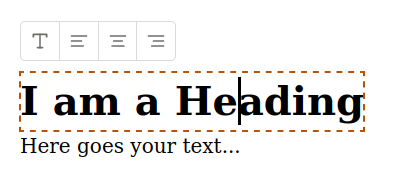
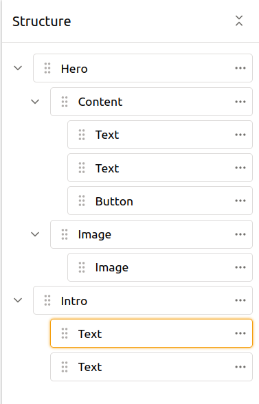
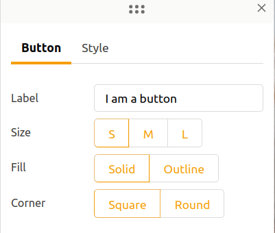
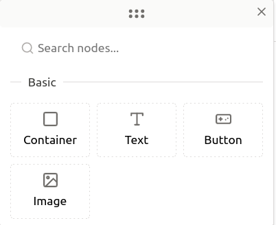

# squarespace concept

Live demo: https://7c78.github.io/squarespace-concept/

This is a prototype of a page builder. It allows users to

* Edit text directly on the page

  

* Rearrange elements using drag and drop within page structure

  

* Update element's properties directly on the page

  

* Add elements to the page

  
